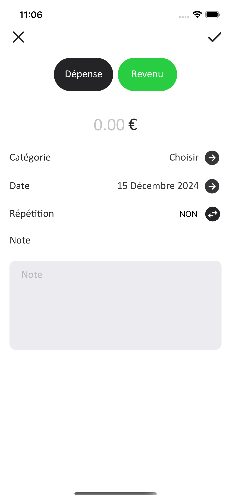

# 💰 TMVBudget

**TMVBudget** is a user-friendly financial management application designed to help users efficiently track and manage their budget. Developed with simplicity and practicality in mind, TMVBudget empowers individuals to take control of their finances, plan for the future, and achieve financial goals with ease.

---

## 🌟 Vision

Managing your budget shouldn't be complicated. **TMVBudget** aims to provide a clean, intuitive, and accessible platform for anyone looking to keep their finances on track, whether it's for personal use, small businesses, or planning for big dreams.

---

## 📋 Key Features

### 📊 **Budget Tracking**
- Keep track of your income and expenses effortlessly.
- Categorize transactions to visualize spending patterns.

### 🔄 **Automatic Calculations**
- Get real-time updates on your financial standing.
- Instantly calculate remaining budget, savings, and more.

### 📈 **Insights & Analytics**
- Generate detailed reports on your financial activity.
- Interactive graphs and charts for an in-depth understanding.

### 🔔 **Notifications**
- Receive reminders for upcoming bills or budget limits.

### 🌍 **Localization**
- Support for multiple currencies and languages.

### 🔐 **Secure Data**
- All your data is securely encrypted to ensure privacy.

---

## 🖼️ Screenshots

Here are some screenshots showcasing the app’s interface and features:

| Screenshot 1               | Screenshot 2               | Screenshot 3               |
|----------------------------|----------------------------|----------------------------|
|  |  |  |

| Screenshot 4               | Screenshot 5               | Screenshot 6               |
|----------------------------|----------------------------|----------------------------|
|  |  |  |

| Screenshot 7               | Screenshot 8               | Screenshot 9               |
|----------------------------|----------------------------|----------------------------|
|  |  |  |

---

## 🛠️ Technology Stack

### **Frontend**
- Flutter for building a cross-platform mobile application.

### **Backend**
- Firebase for real-time database and authentication.

### **Additional Tools**
- **Cloud Firestore**: Efficiently store and manage user data.
- **Dart Programming Language**: For fast, efficient app performance.
- **Material Design**: Ensures a clean and modern UI.

---

## 🚧 Challenges Overcome

1. **User-Friendly Design**: Focused on creating an interface suitable for all users, regardless of tech proficiency.
2. **Cross-Platform Functionality**: Ensured smooth performance on both Android and iOS devices.
3. **Real-Time Updates**: Integrated live syncing of financial data for seamless user experience.

---

## 🏆 Accomplishments

- Successfully launched a financial management app with robust budget tracking and reporting features.
- Delivered a secure and intuitive platform that respects user privacy.
- Provided powerful tools for users to achieve their financial goals.

---

## 🔮 Future Plans

- **AI-Powered Insights**: Personalized recommendations for saving and budgeting.
- **Offline Mode**: Access financial data even without an internet connection.
- **Collaborative Features**: Share budgets with family or team members.
- **Expense Predictions**: Predict upcoming expenses based on historical data.

---

## 🤝 Meet the Developer

- **SR Joy**: Developer and visionary behind TMVBudget. Dedicated to building solutions that make life easier.

For collaboration, feedback, or to develop an app like this, feel free to reach out:
- **GitHub**: [srj101](https://github.com/srj101)
- **Email**: [salimreza6835@gmail.com](mailto:salimreza6835@gmail.com)
- **Phone**: +8801616346835

---

## ❤️ A Message from the Developer

**TMVBudget** is more than just a budgeting app—it’s your financial partner. My goal is to help users simplify their financial journey and achieve peace of mind. Your support, feedback, and ideas are invaluable in making this app even better. Together, let’s take control of our finances!

> _"Take care of the small things, and the big things will take care of themselves."_  
